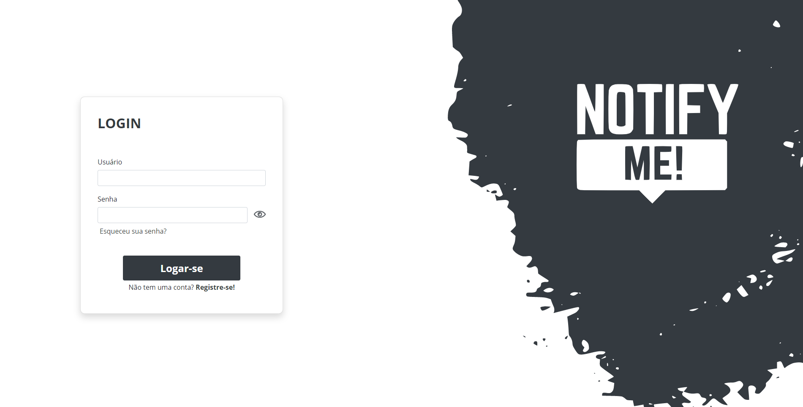
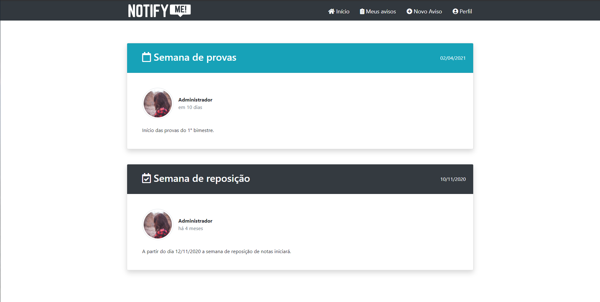
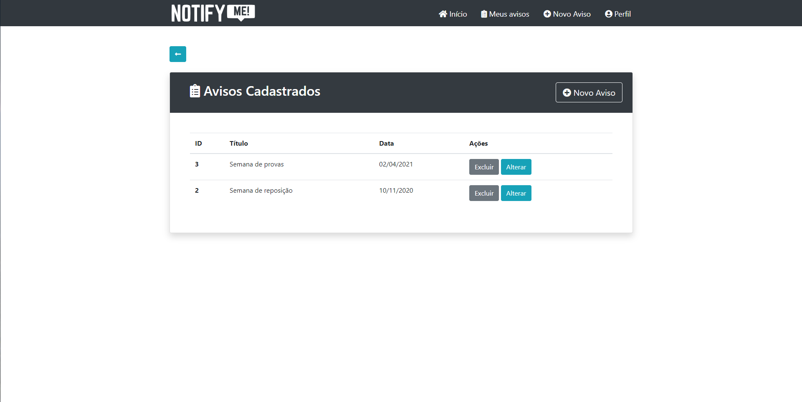
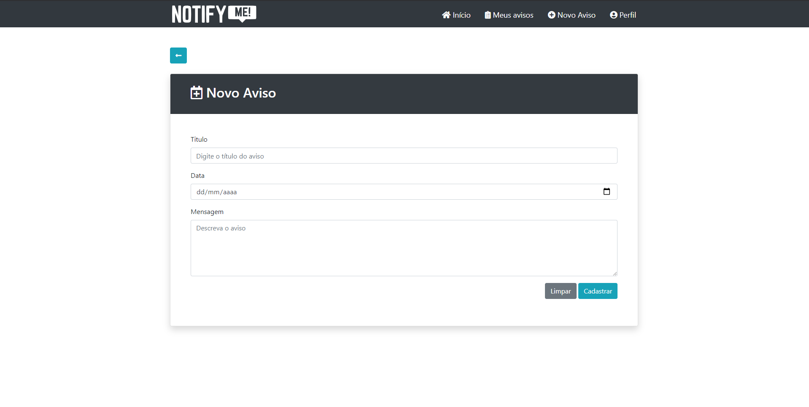
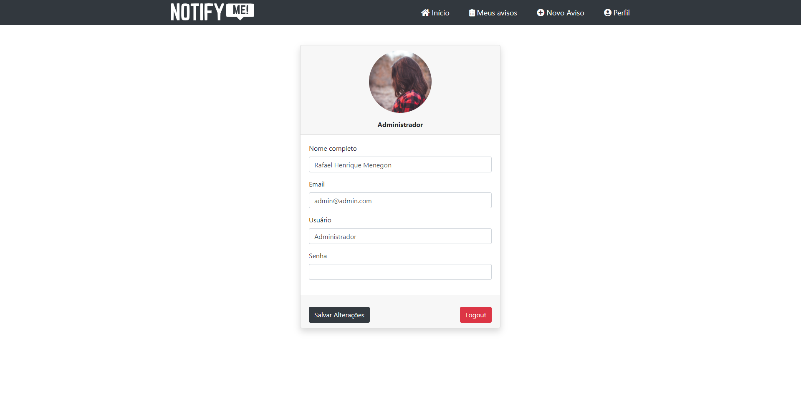

<h1 align="center">
  
</h1>

## 🧪 Technologies

This project was developed using the following technologies:

- [Javascript](https://developer.mozilla.org/pt-BR/docs/Web/JavaScript)
- [EJS](https://ejs.co/)

## 🔥 Preview

Homescreen

My notices

Create new notice

User configs


## 🚀 Getting started

Clone the project and access the folder

```bash
$ git clone https://github.com/C0bal/notify-me && cd notify-me
```

Use the [npm](https://www.npmjs.com/) to install dependences, follow the steps below.

```bash
# Install the dependencies
$ npm

# Start the project
$ npm start
```

## 💻 Project

Basis of the project presented by Professor Fernando Bartholomeu.

## 📝 License

This project is licensed under the MIT License. See the [LICENSE](LICENSE.md) file for details.

---

Projected by Rafael Menegon
